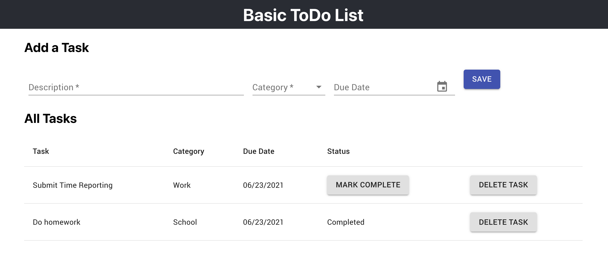

# Basic ToDo App w/ React

This is a basic ToDo app built with Node, Express, SQL, and React.

## Setup
To run this application locally, you must first have Node.js and PostgreSQL installed.

After downloading the code:

1. Create the database. Create a new database with the name `basic-todo`. Run the `database_tables.sql` file to setup the tables. (Note: The database name may be changed by updating the `server/modules/pool.js` file.

2. Optionally add test data by running the `database_test_data.sql` file.

3. Using the command line, go into the application directory and run the following commands to install dependencies `npm install`.

4. Build the React client application using `npm run build`.

5. Start the node server by running `npm start`. You should see that the server is running locally on port 5000. This will keep the console busy. When finished, you will need to stop the server with CTRL + C. 

6. View the application in the browser at [http://localhost:5000/](http://localhost:5000/)

## Functionality

Current features:

- Add a new task to the ToDo list
- View all the tasks on the list
- Mark a task complete
- Delete a task from the list

Upcoming releases will add support for:

- Editing a task description, due date & completion status
- Adding a confirmation dialog before deletion of a task
- Enhanced styling to highlight tasks within 3 days of the due date

## Notes

- This is a fairly basic application with minimal built-in error handling. More details are available from the server log on the command line.

- The React client uses Redux to manage state. Redux sagas are used to handle the Ajax communication with the server.
